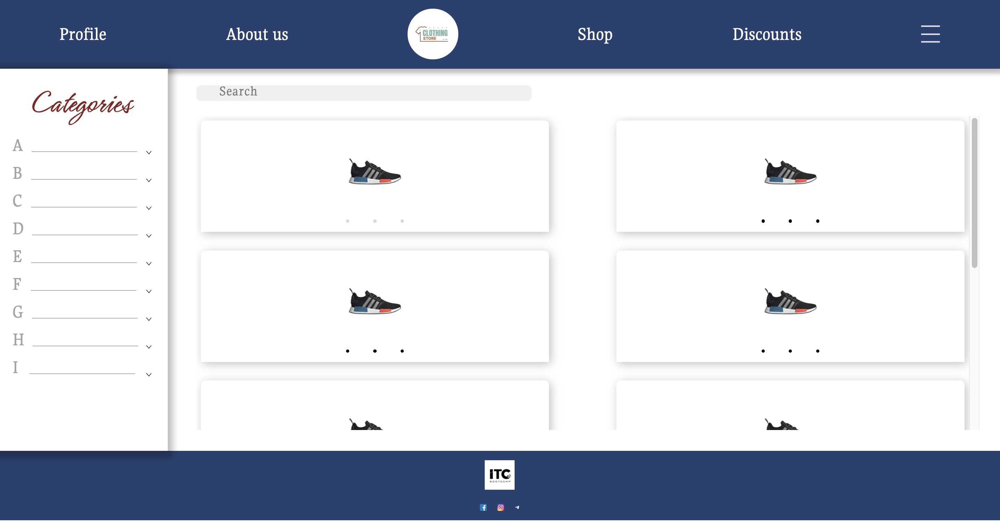
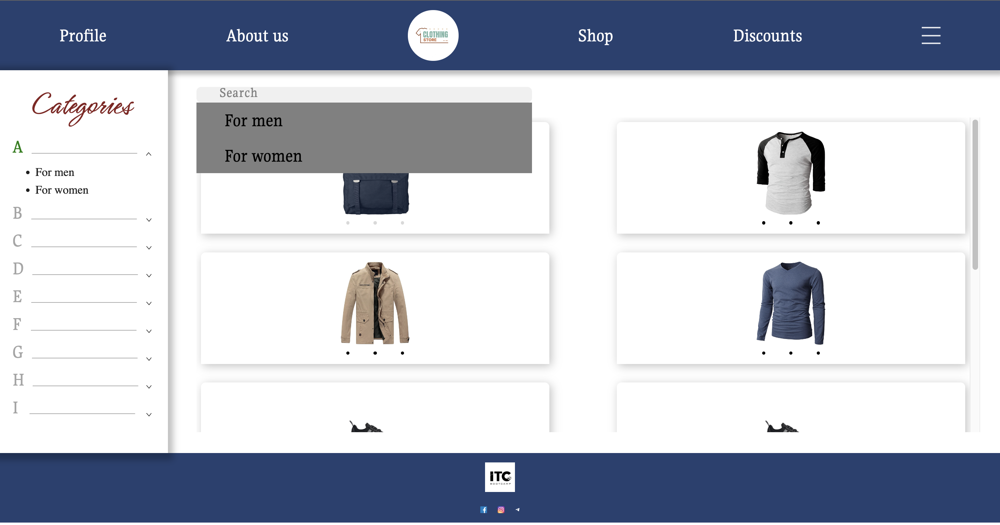
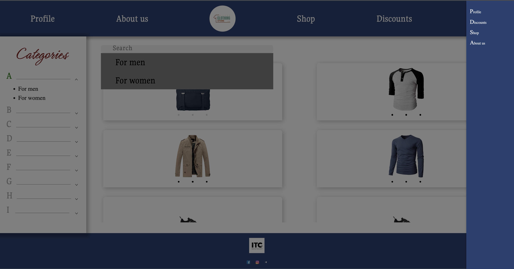

Проект **"Интернет-магазин одежды"** 
Данный шаблон **Интернет-магазина одежды** разработан с использованием чистого *JavaScript* без сторонних библиотек или фреймворков. Пользователи могут легко и удобно просматривать и выбирать одежду по категориям, благодаря интуитивному интерфейсу с панелью категорий, расположенной справа, и поисковой системе. Это делает процесс выбора и покупки одежды быстрым и эффективным
В разработке данного шаблона **Интернет-магазина одежды** использовались современные технологии и инструменты веб-разработки, такие как *HTML5*, *CSS3* и *JavaScript(ES6)*, что обеспечивает надежность, производительность и совместимость с различными устройствами и браузерами
Чтобы начать использовать проект на вашем локальном компьютере, сначала клонируйте репозиторий, выполнив команду *git clone* (https://github.com/IuliiaUsatova/shop-project.git). Затем просто откройте файл *index.html* в вашем браузере, и вы сможете просматривать и взаимодействовать с интернет-магазином